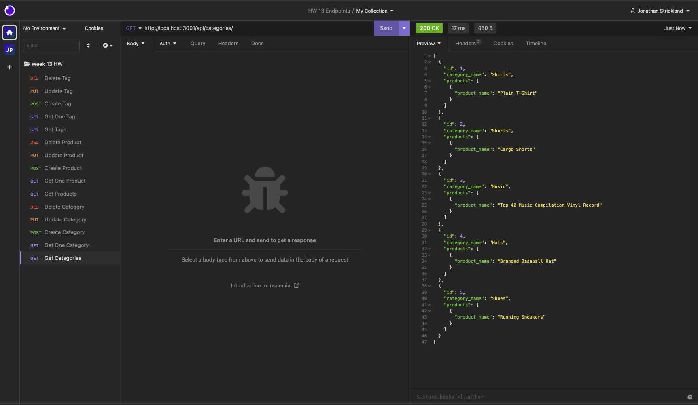
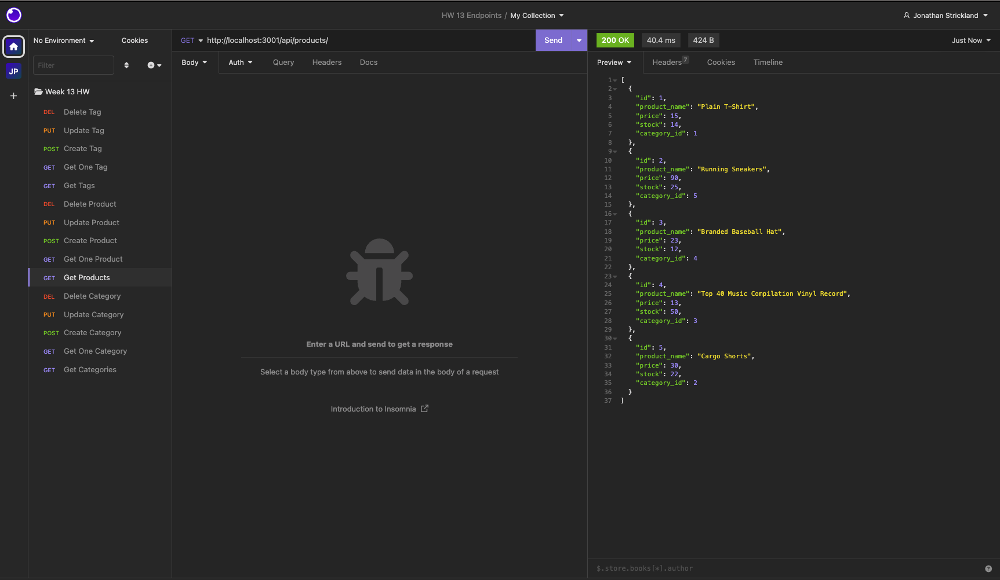
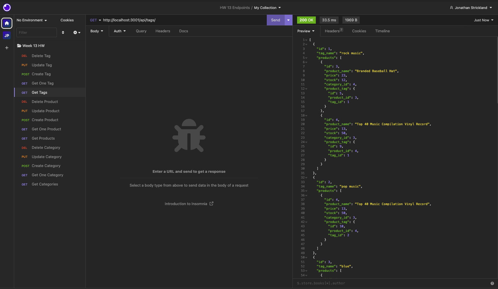

# E-Commerce Backend

<details>
    <summary><h2>Table of Contents</h2></summary>

- [E-Commerce Backend](#e-commerce-backend)
  - [Description](#description)
  - [License](#license)
  - [Technologies Used](#technologies-used)
  - [Screenshots](#screenshots)
  - [Walkthrough Video](#walkthrough-video)
  - [Installation](#installation)
  - [Acknowledgements](#acknowledgements)
  - [Contributors / Contact Info](#contributors--contact-info)

</details>

## Description

In this application we were tasked to create the back end for an e-commerce site by taking a working Express.js API and configure it to use Sequelize to interact with a MySQL database.

## License

[](https://opensource.org/licenses/MIT)

## Technologies Used

    

## Screenshots

Get All Categories Route  Get All Products Route Get All Tags Route 

## Walkthrough Video

[Walkthrough Demonstration on YouTube](https://youtu.be/EIAu0jYkzDs)

## Installation

First you will need to verify that you have Node.js and MySQL installed on your machine.

Next you will need to clone the repository using:

```terminal
git clone https://github.com/JonJonS06/e-commerce-backend.git
```

Next you will need to install the dependencies:

```terminal
npm init --y
```

```terminal
npm install express sequelize mysql2
```

Open MySQL shell in the terminal and enter:

```terminal
source db/schema.sql;
```

and

```terminal
use ecommerce_db;
```

Once that is complete you will "quit" to exit out of MySQL.

Now you need to seed your database using the following command:

```terminal
npm run seed
```

To start the server listening:

```terminal
npm start
```

Now you can open Insomnia on your machine and test the routes created.

## Acknowledgements

Thank you as always to our Bootcamp instructor and TA's for the instruction, guidance, and starter code.

## Contributors / Contact Info

Please feel free to contact me with any questions or suggestions at [jonjon1106@gmail.com](mailto:jonjon1106@gmail.com) or you can view my other projects at [Jonathan Strickland](https://github.com/jonjons06)

[🔼 Back to Top](#e-commerce-backend)
